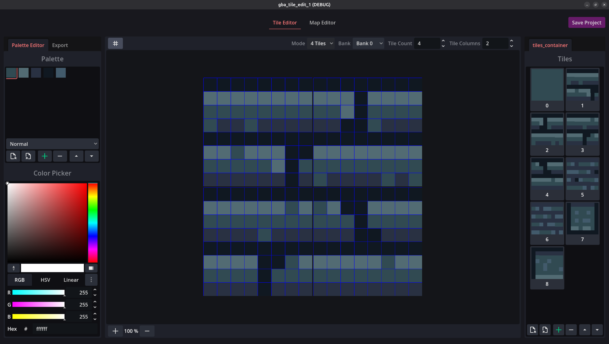
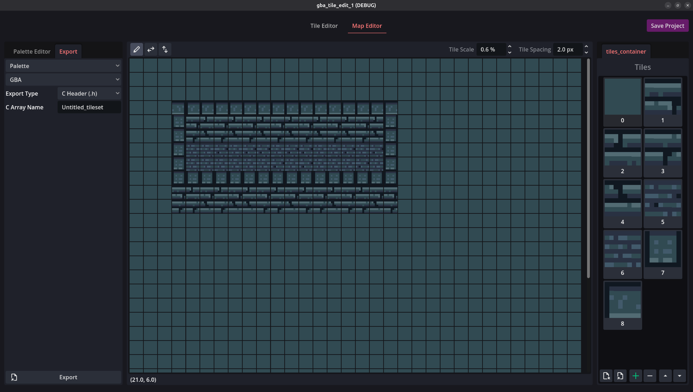

# GB Edit — Tile & Tilemap Editor for Retro Consoles

GB Edit is a cross-platform tile and tilemap editor inspired by classic console hardware like the **Game Boy Advance**, **NES**, and **SNES**.  

