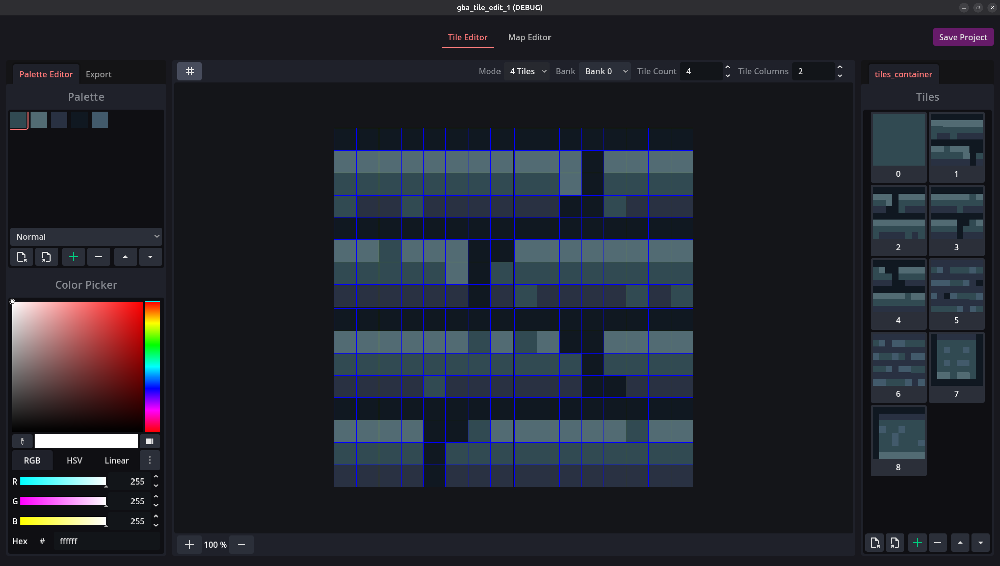
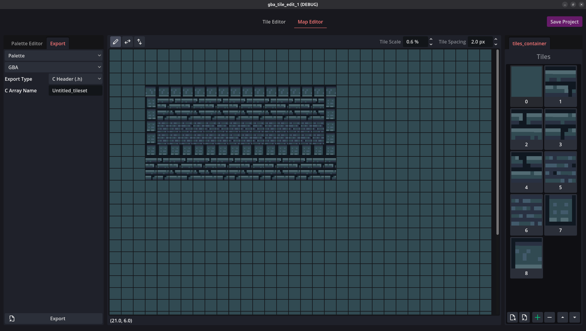

# GB Edit — Tile & Tilemap Editor for Retro Consoles

GB Edit is a cross-platform plugin based tile and tilemap editor for retro console dev like the **Game Boy Advance**, **NES**, and **SNES**.  

## Goals
* have the ability to export to multiple diferent file formats and consoles 
* Users can create there own plugins to add new system presets, exporters and other types of plugins

